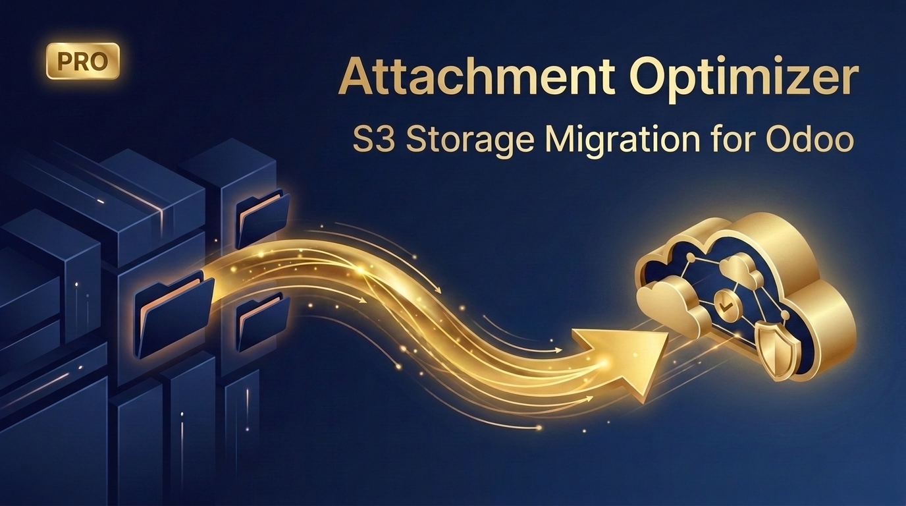
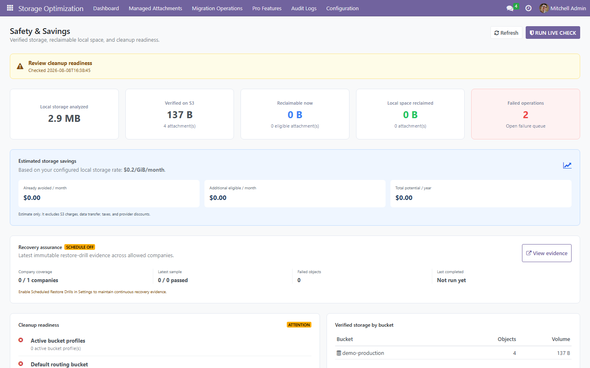
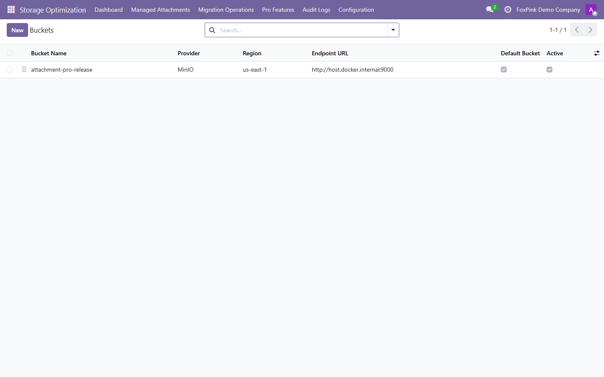
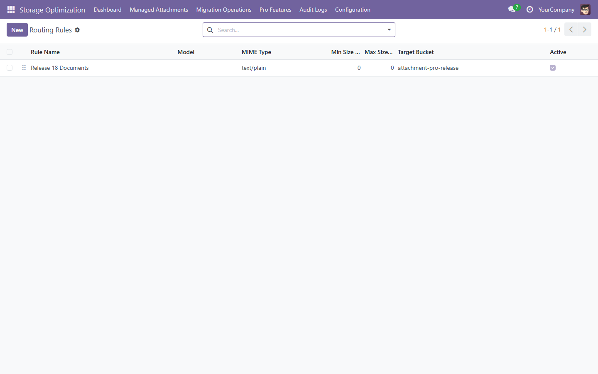
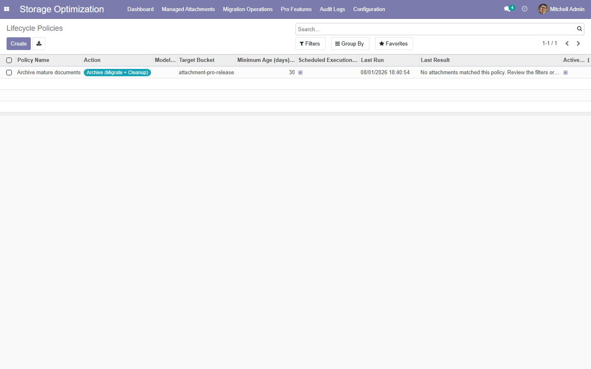
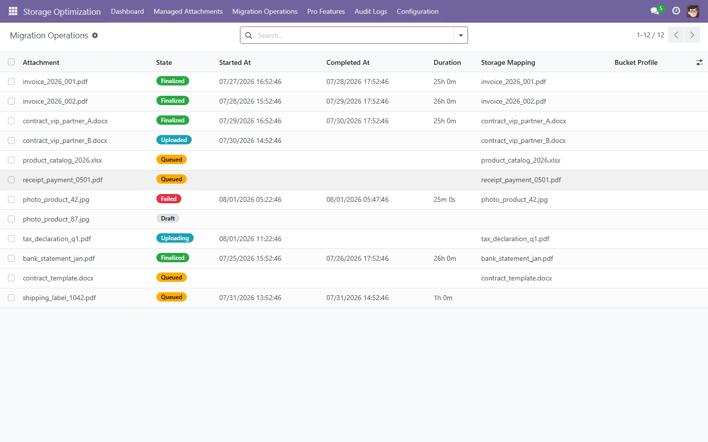
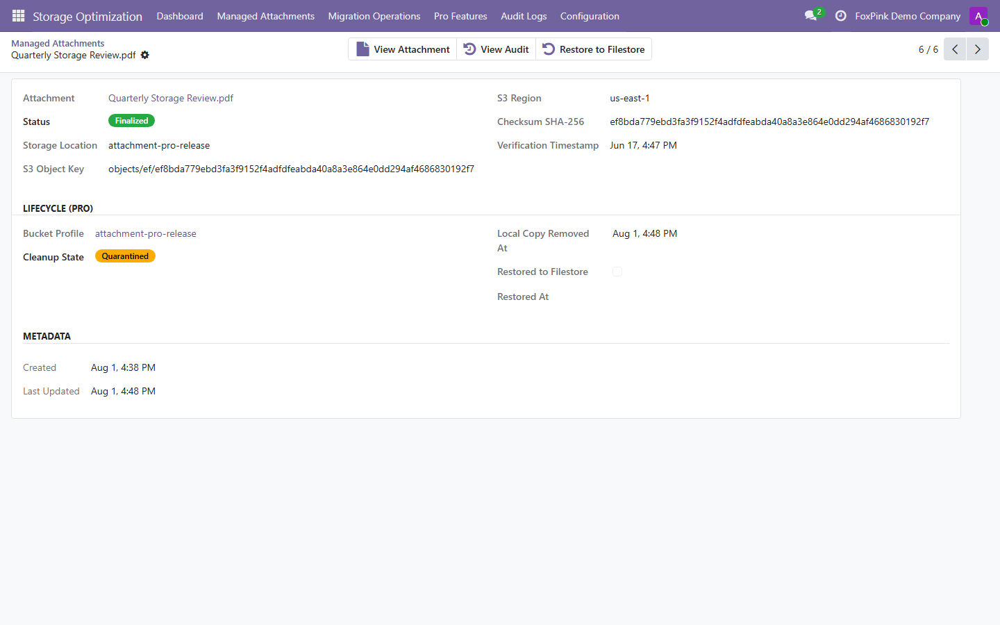
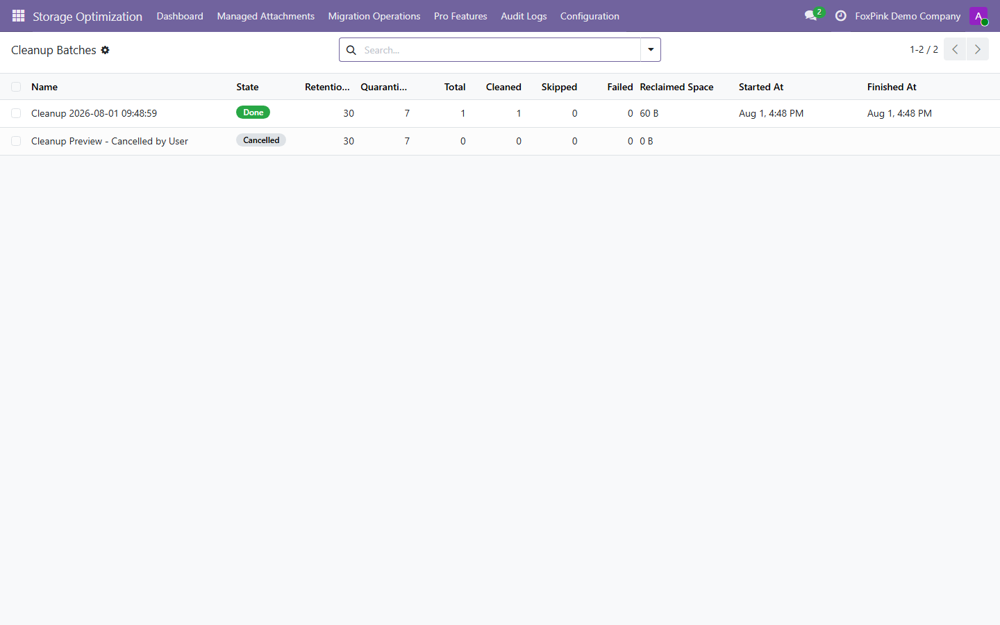
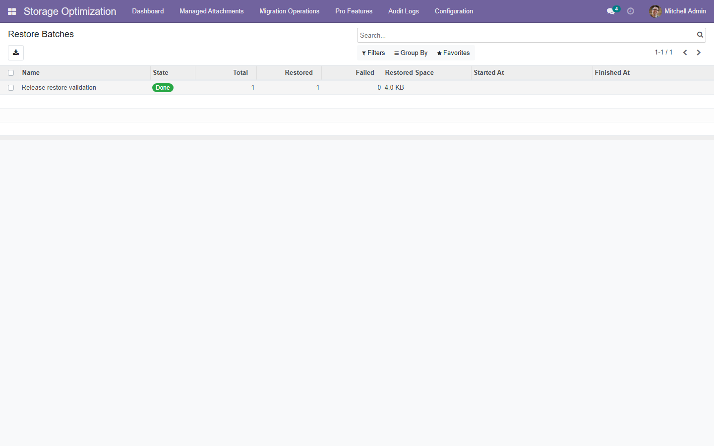
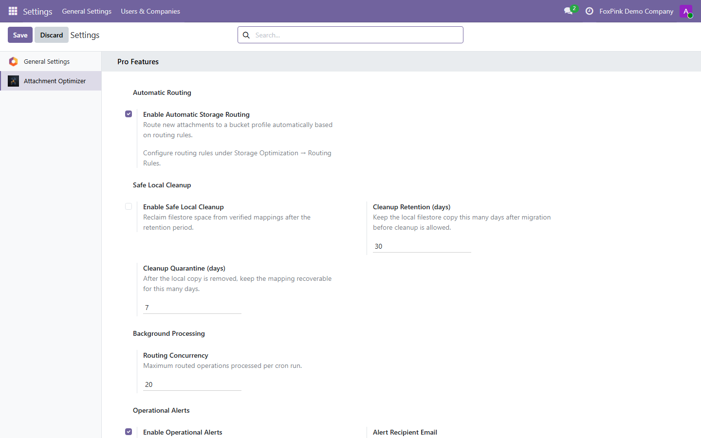

<!-- FOXPINK MODULE README LAYOUT v1.0 — LOCKED
Keep this section order and table shapes for subsequent modules.
Only update product content, version, links, compatibility status, screenshots, and dependencies.
-->
# Attachment Optimizer Pro

> **Automate S3-compatible attachment routing, verified cleanup, lifecycle policies, and recovery.**



**Version:** 18.0.1.0.2 -- **License:** OPL-1 -- **Publisher:** FoxPink -- Maintained for **Odoo 18.0**

---

## Why use Attachment Optimizer Pro?

Attachment Optimizer Pro turns the verified Free Edition pipeline into an automated storage lifecycle. It routes attachments across multiple buckets, verifies every object, safely reclaims local filestore space, and restores files when required without changing normal Odoo workflows.

| Problem | Solution |
|--------|----------|
| Manual attachment routing | Automatic rules by model, MIME type, size, company, and priority |
| Growing local filestore | Checksum-gated cleanup after retention |
| Multiple storage targets | Multi-bucket S3-compatible profiles |
| Recovery concern | One-click restore from finalized objects |
| Operational blind spots | Lifecycle results, analytics, alerts, and audit records |

- **Automate safely** — route → upload → verify → finalize → retain → clean
- **Reclaim storage confidently** — cleanup requires a verified SHA-256 match
- **Restore when needed** — recover selected attachments or complete batches

### Typical use cases

- Odoo environments with rapidly growing filestores
- Multi-company deployments requiring isolated buckets
- Document-heavy accounting, manufacturing, helpdesk, and ERP systems
- Teams requiring scheduled retention and recoverable cleanup

**Best fit:** Odoo.sh or self-hosted deployments that already use, or plan to use, S3-compatible storage and need controlled automation beyond basic upload offloading.

**Not a fit:** Odoo Online, provider-to-provider migration, bandwidth throttling, or monetary cost forecasting. These are intentionally outside the current scope.

> **Move from verified S3 replication to controlled, measurable storage optimization.**

---

## How It Works

```text
Route
    │
Queue
    │
Claim
    │
Upload
    │
Verify
    │
Finalize
    │
Retain
    │
Cleanup
    │
Restore when required
```

---

## Architecture

```text
                  Pro Dashboard
                       │
        ┌──────────────┼──────────────┐
        │              │              │
 Routing Engine   Policy Engine   Alert Service
        │              │              │
        └────────── Batch Services ───┘
                       │
                 S3 Bridge + SHA-256
                       │
           AWS S3 / MinIO / Compatible
```

---

## Features

### Storage

- **Multi-bucket profiles** — configure independent AWS S3, MinIO, or compatible endpoints
- **Company isolation** — apply bucket, rule, policy, cleanup, and restore record rules
- **IAM support** — use runtime credentials without storing long-lived access keys

### Automation

- **Automatic routing** — evaluate model, MIME type, size, company, and priority
- **Lifecycle policies** — schedule migration, archive, cleanup, and restore
- **Concurrent processing** — atomic worker claims prevent duplicate work

### Safety

- **Verified cleanup** — local SHA-256 must match the finalized object before removal
- **Retention and quarantine** — delay cleanup and keep mappings recoverable
- **One-click restore** — restore through Odoo's standard binary writer
- **Actionable errors** — failed and empty operations return clear operator guidance

### Monitoring

- **Storage analytics** — track migrated volume, reclaimed space, and failures
- **Operational alerts** — detect failed queues, stuck operations, and verification failures
- **Batch results** — review processed, skipped, failed, cleaned, and restored records

---

## Safety First

```text
✓ Objects never finalize before SHA-256 verification
✓ Cleanup only processes finalized and retention-eligible mappings
✓ Local data is removed only after checksum confirmation
✓ Restore remains available for quarantined or cleaned mappings
✓ Batch failures are visible and return warning notifications
```

---

## Screenshots











---

## Installation

**Option 1 — Odoo Apps Store:** Purchase and download the ZIP for your Odoo version, unzip it into the addons directory, restart Odoo, and install via Apps. The listed price is **US$49 one-time per Odoo major version**.

**Option 2 — Git for licensed deployments:**

```bash
git clone -b 18.0 https://github.com/FoxPinkHQ/attachment-optimizer addons/attachment_optimizer
git clone -b 18.0 https://github.com/FoxPinkHQ/attachment-optimizer-pro addons/attachment_optimizer_pro
```

Install the required Python dependency in the same runtime that runs Odoo:

```bash
pip3 install boto3
```

When both packages are available in the Odoo addons path, installing Pro makes Odoo resolve and install the Free dependency automatically. For a controlled rollout, update the Apps List, install **Attachment Optimizer** first, validate a small migration, then install **Attachment Optimizer Pro**.

> **Deployment note:** This module requires server-side Python code and `boto3`. It supports Odoo.sh and on-premise/Docker deployments; it is not compatible with Odoo Online.

---

## Getting Started

1. **Install the Free dependency** — verify the base migration pipeline first
2. **Create a bucket** — Pro Features → Buckets → Test Connection
3. **Configure routing** — create ordered rules and enable Automatic Storage Routing
4. **Verify mappings** — confirm objects finalize after SHA-256 verification
5. **Apply lifecycle policies** — configure retention, quarantine, and schedules
6. **Run cleanup or restore** — use selected-record actions or scheduled policies
7. **Monitor operations** — review batches, analytics, alerts, and audit logs

---

## Configuration

1. **Buckets:** configure endpoint, region, bucket, encryption, company scope, and optional credentials
2. **Routing Rules:** select target model, MIME type, size range, priority, and bucket
3. **Lifecycle Policies:** select action, filters, retention, quarantine, and interval
4. **Settings:** enable routing, cleanup, concurrency, and operational alerts

> **Recommended:** test every bucket connection and complete a restore rehearsal before enabling automatic cleanup.

---

## Security

- **Role-based access** — Pro menus and records require Storage Optimization Manager
- **Multi-company isolation** — record rules protect configuration and operational data
- **Credential protection** — bucket Import/Export is disabled to prevent accidental secret exposure
- **Controlled records** — mappings and batches cannot be manually created or imported
- **Auditable exports** — rules, policies, batches, mappings, operations, and logs support XLSX export

---

## Current Limitations

- Requires the Attachment Optimizer Free Edition
- Requires `boto3` in the Odoo server runtime
- Supports S3-compatible object storage; provider-specific non-S3 APIs are outside scope
- Odoo Online is not supported because external Python dependencies are required
- This branch is validated for Odoo 18.0; other series require their dedicated validated build

---

## Free Edition and Pro

The Free Edition provides the complete verified migration foundation without trial limits. Pro adds automation, measurable filestore reclamation, multi-bucket routing, lifecycle control, restore workflows, analytics, and alerts.

| Free Edition | Pro Edition — US$49 |
|---|---|
| Storage analysis and migration queue | Automatic routing and scheduled lifecycle policies |
| SHA-256 upload verification | Checksum-gated local cleanup with retention |
| Transparent reads and filestore fallback | Multi-bucket and multi-company routing |
| Retry, recovery, dashboard, and audit | Restore batches, analytics, concurrency, and alerts |

> **Pricing:** US$49 one-time per Odoo major version. Hosting, object-storage usage, installation, migration, and custom support are not included.

---

## Technical Notes

- **Free module remains the dependency and safety foundation**
- **Finalized objects are served through Odoo** with filestore fallback
- **Policy cron evaluates only enabled policies that are due**
- **Worker claims are atomic** using `FOR UPDATE SKIP LOCKED`
- **Expected S3 missing-object responses do not retry unnecessarily**
- **No changes to existing business document workflows**

---

## Compatibility

Validated release available for every Odoo series from 14.0 to 19.0.

Every supported Odoo version has its own dedicated branch and release package.

| Odoo Version | Status |
|---|---|
| 19.0 | [Branch 19.0](https://github.com/FoxPinkHQ/attachment-optimizer-pro/tree/19.0) |
| 18.0 | ✅ This branch |
| 17.0 | [Branch 17.0](https://github.com/FoxPinkHQ/attachment-optimizer-pro/tree/17.0) |
| 16.0 | [Branch 16.0](https://github.com/FoxPinkHQ/attachment-optimizer-pro/tree/16.0) |
| 15.0 | [Branch 15.0](https://github.com/FoxPinkHQ/attachment-optimizer-pro/tree/15.0) |
| 14.0 | [Branch 14.0](https://github.com/FoxPinkHQ/attachment-optimizer-pro/tree/14.0) |

---

## Dependencies

- `attachment_optimizer` Free Edition
- `base`
- `web`
- `mail`
- **Python:** `boto3`

---

## Support

- **Product issues:** [Contact FoxPink](mailto:aduy000@gmail.com) with the Odoo version, module version, reproduction steps, and relevant logs
- **Scope:** product defect support is available; installation, infrastructure, data migration, and custom development are separate services
- **Publisher:** FoxPink

---

## License

**OPL-1 (Odoo Proprietary License v1.0)** — see [LICENSE](LICENSE).
